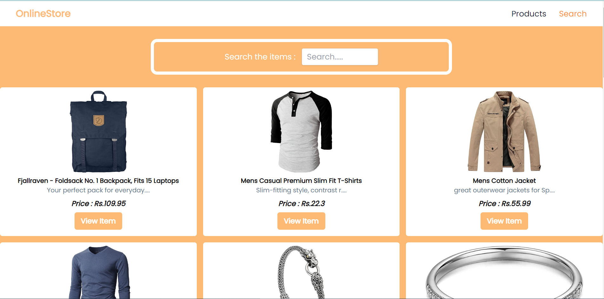

**OnlineStore App**

**Project Description**
Simple online store built using Fakestore API. Simple React Project.

**Demo**
Link : https://online-store-by-chandan.netlify.app/




**Installation**
To set up the project locally, follow these steps:

1. Clone the repository:
   ```bash
   git clone https://github.com/chandanmaka/frontend-assignment.git
   cd front-assignment

2. Install the dependencies:
   ```react
   npm install

4. Start locally :
   npm start

5. Open in browser :
   http://localhost:3000

Happy coding! 😄
